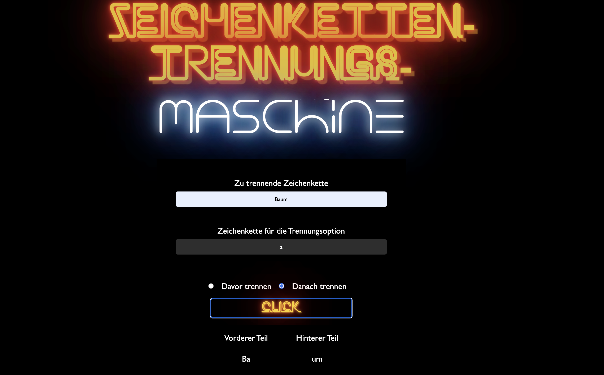

# Zeichenketten-Trennungs-Maschine

## Übersicht

Dieses Projekt implementiert eine Zeichenketten-Trennungs-Maschine mit **JavaScript**, **HTML**, und **CSS**. Die Maschine bietet die Möglichkeit, eine Zeichenkette entweder **davor** oder **danach** eines bestimmten Zeichens zu trennen, das der Benutzer angibt. Die Hauptfunktionalität basiert auf der Verwendung von JavaScript-Methoden wie `slice` und einer `if-else`-Logik.

---

# Vorschau


## Projektstruktur

```plaintext
ZEICHENKETTENTRENNUNGSMASCHINE/
├── assets/
│   ├── css/
│   ├── js/
│       └── main.js
├── index.html
└── .gitignore
```

## Features

### Trennen der Zeichenkette
- **Davor trennen:**  
  Schneidet die Zeichenkette vor dem angegebenen Zeichen ab.

- **Danach trennen:**  
  Schneidet die Zeichenkette nach dem angegebenen Zeichen ab.

### Fehlerbehandlung
- Gibt eine Warnung aus, wenn das Zeichen in der Zeichenkette nicht gefunden wird.
- Beispiel:  
  ```text
  Verwende nur Zeichen, die im Satz vorkommen.```

Interaktive Benutzeroberfläche

	•	Eingabefelder für:
	•	Die zu trennende Zeichenkette.
	•	Das Zeichen, anhand dessen die Trennung erfolgt.
	•	Radiobuttons für die Auswahl:
	•	Davor trennen
	•	Danach trennen
	•	Button zum Ausführen der Trennoperation.
